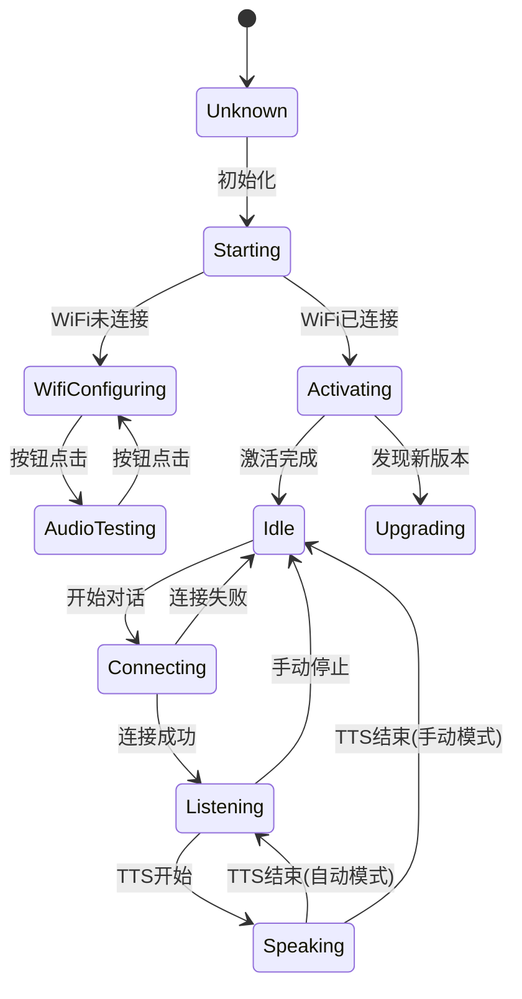
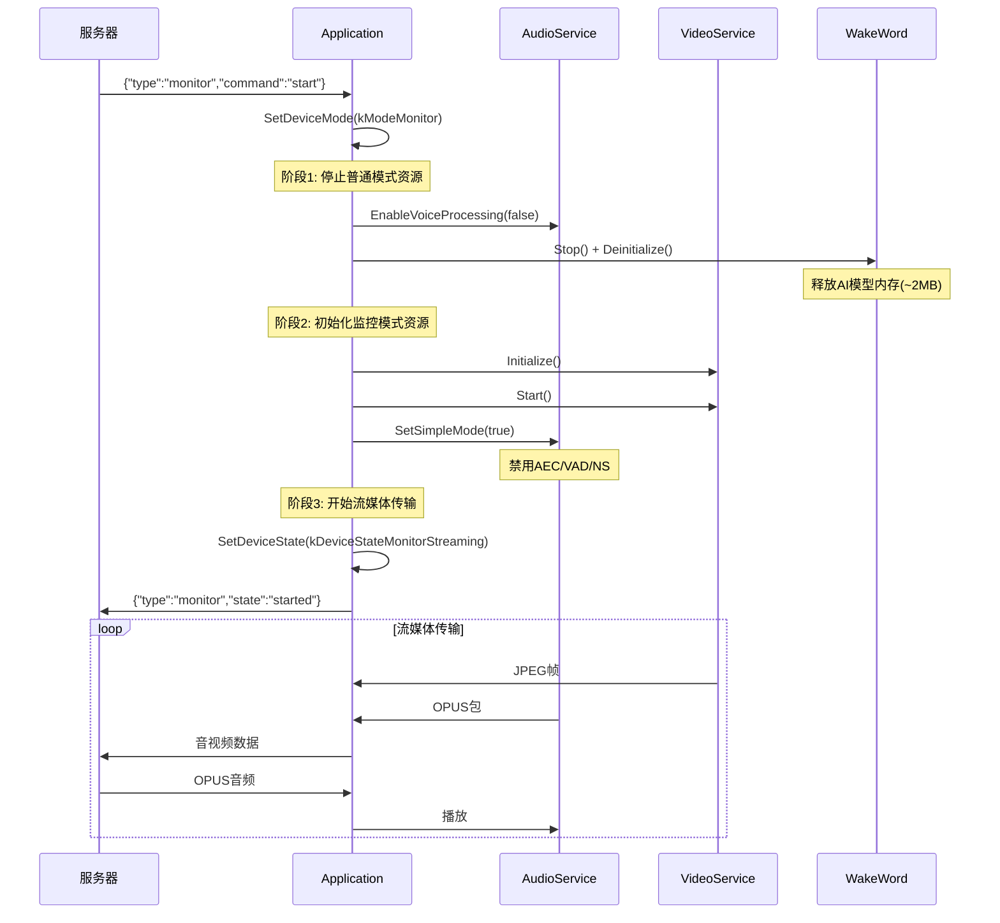
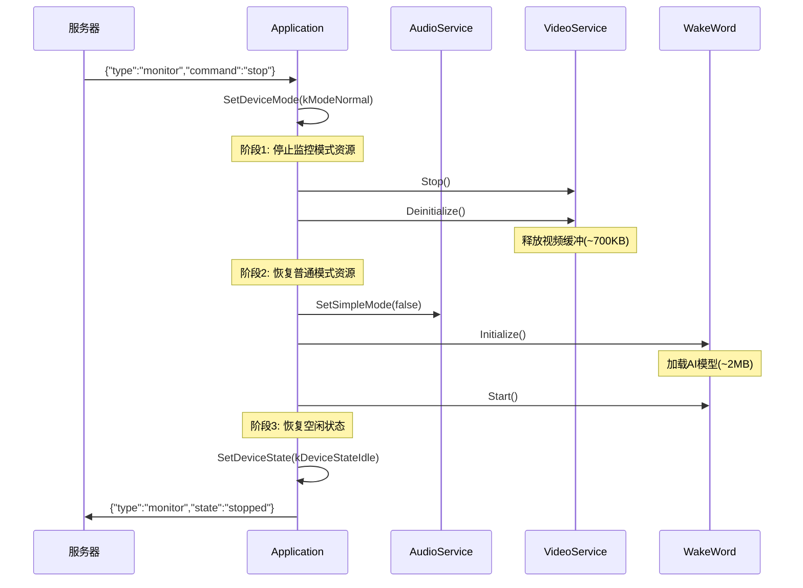

# 模式切换设计详细分析

## 1. 当前状态机分析

### 1.1 现有状态定义

```cpp
enum DeviceState {
    kDeviceStateUnknown,        // 未知状态
    kDeviceStateStarting,       // 启动中
    kDeviceStateWifiConfiguring,// WiFi配置中
    kDeviceStateIdle,           // 空闲
    kDeviceStateConnecting,     // 连接中
    kDeviceStateListening,      // 聆听中
    kDeviceStateSpeaking,       // 说话中
    kDeviceStateUpgrading,      // 升级中
    kDeviceStateActivating,     // 激活中
    kDeviceStateAudioTesting,   // 音频测试中
    kDeviceStateFatalError      // 致命错误
};
```

### 1.2 当前状态转换图




### 1.3 状态切换时的资源管理

当前 `SetDeviceState()` 方法中的资源管理：

| 状态 | 唤醒词检测 | 语音处理 | 显示状态 |
|------|-----------|----------|----------|
| Idle | ✅ 启用 | ❌ 禁用 | "待机" |
| Connecting | - | - | "连接中" |
| Listening | ❌ 禁用 | ✅ 启用 | "聆听中" |
| Speaking | 条件启用 | 条件禁用 | "说话中" |

---

## 2. 模式切换设计方案

### 2.1 设计目标

1. **高性能**：每个模式都能充分利用硬件资源
2. **低延迟**：模式切换快速，无明显卡顿
3. **资源隔离**：不同模式的资源不互相干扰
4. **平滑过渡**：切换过程中不丢失数据

### 2.2 新增模式定义

```cpp
// 设备运行模式（高层概念）
enum DeviceMode {
    kModeNormal,      // 普通模式：AI语音对话
    kModeMonitor,     // 监控模式：实时视频对讲
};

// 扩展设备状态
enum DeviceState {
    // ... 现有状态 ...
    kDeviceStateMonitorConnecting,  // 监控模式-连接中
    kDeviceStateMonitorStreaming,   // 监控模式-流媒体传输中
    kDeviceStateMonitorPaused,      // 监控模式-暂停
};
```

### 2.3 模式与状态的关系

```
┌─────────────────────────────────────────────────────────────────────────────┐
│                              DeviceMode                                      │
├─────────────────────────────────┬───────────────────────────────────────────┤
│         kModeNormal             │            kModeMonitor                    │
├─────────────────────────────────┼───────────────────────────────────────────┤
│  ┌─────────────────────────┐    │    ┌─────────────────────────┐            │
│  │ kDeviceStateIdle        │    │    │ kDeviceStateMonitorConnecting │      │
│  │ kDeviceStateConnecting  │    │    │ kDeviceStateMonitorStreaming  │      │
│  │ kDeviceStateListening   │    │    │ kDeviceStateMonitorPaused     │      │
│  │ kDeviceStateSpeaking    │    │    └─────────────────────────┘            │
│  └─────────────────────────┘    │                                           │
└─────────────────────────────────┴───────────────────────────────────────────┘
```

---

## 3. 资源管理策略

### 3.1 资源分类

```
┌─────────────────────────────────────────────────────────────────────────────┐
│                              系统资源                                        │
├─────────────────────────────────────────────────────────────────────────────┤
│                                                                             │
│  ┌─────────────────┐  ┌─────────────────┐  ┌─────────────────┐             │
│  │   CPU 资源       │  │   内存资源       │  │   I/O 资源       │             │
│  ├─────────────────┤  ├─────────────────┤  ├─────────────────┤             │
│  │ • 音频处理任务   │  │ • 音频队列      │  │ • I2S (音频)    │             │
│  │ • 视频捕获任务   │  │ • 视频帧缓冲    │  │ • DVP (摄像头)  │             │
│  │ • 编解码任务     │  │ • 编码缓冲      │  │ • SPI (显示屏)  │             │
│  │ • 网络任务       │  │ • 网络缓冲      │  │ • WiFi          │             │
│  │ • 唤醒词检测     │  │ • AI模型        │  │                 │             │
│  └─────────────────┘  └─────────────────┘  └─────────────────┘             │
└─────────────────────────────────────────────────────────────────────────────┘
```

### 3.2 普通模式资源分配

```
┌─────────────────────────────────────────────────────────────────────────────┐
│                         普通模式 (kModeNormal)                               │
├─────────────────────────────────────────────────────────────────────────────┤
│                                                                             │
│  CPU 分配:                                                                  │
│  ┌─────────────────────────────────────────────────────────────────┐       │
│  │ Core 0: AudioInputTask (优先级8) + WakeWord                      │       │
│  │ Core 1: MainEventLoop + OpusCodec + AudioOutput + Network        │       │
│  └─────────────────────────────────────────────────────────────────┘       │
│                                                                             │
│  内存分配:                                                                  │
│  ┌─────────────────────────────────────────────────────────────────┐       │
│  │ SRAM: 音频队列(~20KB) + 任务栈(~30KB) + 系统(~50KB)              │       │
│  │ PSRAM: AI模型(~2MB) + 显示缓冲(~150KB)                           │       │
│  └─────────────────────────────────────────────────────────────────┘       │
│                                                                             │
│  活跃任务:                                                                  │
│  • AudioInputTask     - 音频采集                                           │
│  • AudioOutputTask    - 音频播放                                           │
│  • OpusCodecTask      - 音频编解码                                         │
│  • WakeWordTask       - 唤醒词检测 (Idle状态)                              │
│  • AudioProcessorTask - 音频处理 (Listening状态)                           │
│                                                                             │
│  休眠资源:                                                                  │
│  • 摄像头 DVP 接口                                                         │
│  • 视频编码器                                                               │
└─────────────────────────────────────────────────────────────────────────────┘
```

### 3.3 监控模式资源分配

```
┌─────────────────────────────────────────────────────────────────────────────┐
│                         监控模式 (kModeMonitor)                              │
├─────────────────────────────────────────────────────────────────────────────┤
│                                                                             │
│  CPU 分配:                                                                  │
│  ┌─────────────────────────────────────────────────────────────────┐       │
│  │ Core 0: VideoCaptureTask (优先级7) + AudioInputTask (优先级8)    │       │
│  │ Core 1: JpegEncodeTask + OpusCodec + StreamMuxer + Network       │       │
│  └─────────────────────────────────────────────────────────────────┘       │
│                                                                             │
│  内存分配:                                                                  │
│  ┌─────────────────────────────────────────────────────────────────┐       │
│  │ SRAM: 音频队列(~10KB) + 任务栈(~40KB) + 系统(~50KB)              │       │
│  │ PSRAM: 视频帧缓冲(~600KB) + JPEG缓冲(~100KB) + 显示(~150KB)      │       │
│  └─────────────────────────────────────────────────────────────────┘       │
│                                                                             │
│  活跃任务:                                                                  │
│  • VideoCaptureTask   - 视频采集                                           │
│  • JpegEncodeTask     - JPEG编码                                           │
│  • AudioInputTask     - 音频采集 (简化版，无VAD)                           │
│  • AudioOutputTask    - 音频播放                                           │
│  • OpusCodecTask      - 音频编解码                                         │
│  • StreamMuxerTask    - 音视频混合                                         │
│                                                                             │
│  休眠资源:                                                                  │
│  • 唤醒词检测模型 (释放~2MB PSRAM)                                         │
│  • AudioProcessor (AEC/VAD/NS)                                             │
└─────────────────────────────────────────────────────────────────────────────┘
```


---

## 4. 模式切换流程设计

### 4.1 普通模式 → 监控模式



### 4.2 监控模式 → 普通模式



### 4.3 切换时序要求

| 阶段 | 操作 | 最大耗时 | 说明 |
|------|------|----------|------|
| 停止旧资源 | 停止任务、清空队列 | 100ms | 需要等待当前帧处理完成 |
| 释放内存 | 释放模型/缓冲 | 50ms | PSRAM释放较快 |
| 分配内存 | 分配新缓冲 | 100ms | PSRAM分配可能碎片化 |
| 初始化新资源 | 初始化任务、硬件 | 200ms | 摄像头ISP预热需要时间 |
| **总计** | | **450ms** | 目标<500ms |

---

## 5. 高性能设计策略

### 5.1 任务优先级设计

```cpp
// 普通模式任务优先级
#define PRIORITY_AUDIO_INPUT        8   // 最高，保证音频不丢失
#define PRIORITY_WAKE_WORD          6   // 唤醒词检测
#define PRIORITY_AUDIO_OUTPUT       4   // 音频输出
#define PRIORITY_MAIN_LOOP          3   // 主事件循环
#define PRIORITY_OPUS_CODEC         2   // 编解码

// 监控模式任务优先级
#define PRIORITY_AUDIO_INPUT_MON    8   // 音频输入仍然最高
#define PRIORITY_VIDEO_CAPTURE      7   // 视频捕获次之
#define PRIORITY_JPEG_ENCODE        5   // JPEG编码
#define PRIORITY_AUDIO_OUTPUT_MON   4   // 音频输出
#define PRIORITY_STREAM_MUXER       3   // 流混合
#define PRIORITY_OPUS_CODEC_MON     2   // 编解码
```

### 5.2 CPU核心绑定策略

```cpp
// 普通模式
// Core 0: 实时音频处理
xTaskCreatePinnedToCore(AudioInputTask, "audio_in", 4096, this, 8, &handle, 0);
xTaskCreatePinnedToCore(WakeWordTask, "wake_word", 4096, this, 6, &handle, 0);

// Core 1: 非实时处理
xTaskCreate(AudioOutputTask, "audio_out", 2048, this, 4, &handle);
xTaskCreate(OpusCodecTask, "opus", 8192, this, 2, &handle);

// 监控模式
// Core 0: 实时采集
xTaskCreatePinnedToCore(AudioInputTask, "audio_in", 2048, this, 8, &handle, 0);
xTaskCreatePinnedToCore(VideoCaptureTask, "video_cap", 4096, this, 7, &handle, 0);

// Core 1: 编码和传输
xTaskCreate(JpegEncodeTask, "jpeg_enc", 8192, this, 5, &handle);
xTaskCreate(AudioOutputTask, "audio_out", 2048, this, 4, &handle);
xTaskCreate(StreamMuxerTask, "muxer", 4096, this, 3, &handle);
```

### 5.3 内存池设计

```cpp
class MemoryPool {
public:
    // 预分配的内存块
    struct Block {
        uint8_t* data;
        size_t size;
        bool in_use;
    };
    
    // 视频帧池（监控模式）
    static constexpr int VIDEO_FRAME_COUNT = 3;
    static constexpr size_t VIDEO_FRAME_SIZE = 640 * 480 * 2; // RGB565
    
    // JPEG缓冲池
    static constexpr int JPEG_BUFFER_COUNT = 2;
    static constexpr size_t JPEG_BUFFER_SIZE = 50 * 1024; // 50KB per frame
    
    // 音频缓冲池（两种模式共用）
    static constexpr int AUDIO_BUFFER_COUNT = 4;
    static constexpr size_t AUDIO_BUFFER_SIZE = 960 * 2; // 60ms @ 16kHz
    
    Block* Allocate(PoolType type);
    void Release(Block* block);
    
private:
    std::array<Block, VIDEO_FRAME_COUNT> video_pool_;
    std::array<Block, JPEG_BUFFER_COUNT> jpeg_pool_;
    std::array<Block, AUDIO_BUFFER_COUNT> audio_pool_;
};
```

### 5.4 零拷贝数据流

```cpp
// 视频帧结构（支持零拷贝）
struct VideoFrame {
    uint8_t* data;          // 指向内存池
    size_t size;
    uint16_t width;
    uint16_t height;
    uint32_t timestamp;
    MemoryPool::Block* block; // 用于释放
    
    // 移动语义，避免拷贝
    VideoFrame(VideoFrame&& other) noexcept;
    VideoFrame& operator=(VideoFrame&& other) noexcept;
    
    // 禁止拷贝
    VideoFrame(const VideoFrame&) = delete;
    VideoFrame& operator=(const VideoFrame&) = delete;
};

// JPEG编码回调（流式，无需完整缓冲）
using JpegChunkCallback = std::function<void(const uint8_t* data, size_t len)>;
```


---

## 6. 模式管理器设计

### 6.1 ModeManager 类设计

```cpp
/**
 * @class ModeManager
 * @brief 设备模式管理器，负责模式切换和资源协调
 */
class ModeManager {
public:
    static ModeManager& GetInstance();
    
    // 模式切换
    bool SwitchToNormalMode();
    bool SwitchToMonitorMode(const MonitorConfig& config);
    
    // 状态查询
    DeviceMode GetCurrentMode() const { return current_mode_; }
    bool IsSwitching() const { return is_switching_; }
    
    // 资源状态
    bool IsWakeWordAvailable() const;
    bool IsVideoStreamAvailable() const;
    
    // 回调注册
    void OnModeChanged(std::function<void(DeviceMode, DeviceMode)> callback);
    void OnSwitchProgress(std::function<void(int progress, const char* stage)> callback);
    
private:
    ModeManager();
    
    // 模式切换实现
    bool DoSwitchToNormal();
    bool DoSwitchToMonitor(const MonitorConfig& config);
    
    // 资源管理
    void ReleaseNormalModeResources();
    void ReleaseMonitorModeResources();
    bool AllocateNormalModeResources();
    bool AllocateMonitorModeResources(const MonitorConfig& config);
    
    // 状态
    DeviceMode current_mode_ = kModeNormal;
    std::atomic<bool> is_switching_{false};
    std::mutex switch_mutex_;
    
    // 回调
    std::vector<std::function<void(DeviceMode, DeviceMode)>> mode_change_callbacks_;
    std::function<void(int, const char*)> progress_callback_;
};
```

### 6.2 监控模式配置

```cpp
struct MonitorConfig {
    // 视频参数
    uint16_t video_width = 640;
    uint16_t video_height = 480;
    uint8_t video_fps = 15;
    uint8_t jpeg_quality = 80;
    
    // 音频参数
    bool audio_enabled = true;
    bool audio_aec_enabled = false;  // 监控模式通常不需要AEC
    
    // 网络参数
    uint32_t max_bitrate = 4000000;  // 4Mbps
    bool adaptive_bitrate = true;
    
    // 显示参数
    bool local_preview = true;
};
```

### 6.3 模式切换状态机

```cpp
enum ModeSwitchState {
    kSwitchStateIdle,
    kSwitchStateStoppingOldMode,
    kSwitchStateReleasingResources,
    kSwitchStateAllocatingResources,
    kSwitchStateInitializingNewMode,
    kSwitchStateStartingNewMode,
    kSwitchStateComplete,
    kSwitchStateFailed
};

class ModeSwitchStateMachine {
public:
    void Start(DeviceMode target_mode);
    void Process();
    bool IsComplete() const;
    bool IsFailed() const;
    const char* GetCurrentStageName() const;
    int GetProgress() const;
    
private:
    ModeSwitchState state_ = kSwitchStateIdle;
    DeviceMode target_mode_;
    int progress_ = 0;
    std::string error_message_;
};
```

---

## 7. 音频服务适配

### 7.1 简化模式（监控模式用）

```cpp
class AudioService {
public:
    // 新增：简化模式控制
    void SetSimpleMode(bool enable);
    bool IsSimpleMode() const { return simple_mode_; }
    
private:
    bool simple_mode_ = false;
    
    // 简化模式下的音频输入任务
    void AudioInputTaskSimple() {
        while (!service_stopped_) {
            std::vector<int16_t> data;
            int samples = OPUS_FRAME_DURATION_MS * 16000 / 1000;
            
            if (ReadAudioData(data, 16000, samples)) {
                // 简化模式：直接编码，不经过AudioProcessor
                if (codec_->input_channels() == 2) {
                    // 只取左声道
                    auto mono = ExtractLeftChannel(data);
                    PushTaskToEncodeQueue(kAudioTaskTypeEncodeToSendQueue, std::move(mono));
                } else {
                    PushTaskToEncodeQueue(kAudioTaskTypeEncodeToSendQueue, std::move(data));
                }
            }
        }
    }
};
```

### 7.2 资源释放接口

```cpp
class AudioService {
public:
    // 新增：资源管理接口
    void ReleaseWakeWordResources();
    void RestoreWakeWordResources();
    void ReleaseProcessorResources();
    void RestoreProcessorResources();
    
    // 内存使用查询
    size_t GetWakeWordMemoryUsage() const;
    size_t GetProcessorMemoryUsage() const;
};
```

---

## 8. 视频服务设计

### 8.1 VideoStreamService 类

```cpp
class VideoStreamService {
public:
    static VideoStreamService& GetInstance();
    
    // 生命周期
    bool Initialize(const MonitorConfig& config);
    void Deinitialize();
    bool Start();
    void Stop();
    
    // 配置
    void SetFrameRate(int fps);
    void SetQuality(int quality);
    void SetResolution(int width, int height);
    
    // 状态
    bool IsRunning() const;
    int GetCurrentFps() const;
    size_t GetBitrate() const;
    
    // 回调
    void OnFrameEncoded(std::function<void(std::unique_ptr<JpegPacket>)> callback);
    void OnError(std::function<void(const std::string&)> callback);
    
private:
    VideoStreamService();
    
    void VideoCaptureTask();
    void JpegEncodeTask();
    
    // 配置
    MonitorConfig config_;
    
    // 任务
    TaskHandle_t capture_task_ = nullptr;
    TaskHandle_t encode_task_ = nullptr;
    
    // 队列
    std::deque<std::unique_ptr<VideoFrame>> capture_queue_;
    std::deque<std::unique_ptr<JpegPacket>> send_queue_;
    
    // 同步
    std::mutex queue_mutex_;
    std::condition_variable queue_cv_;
    
    // 状态
    std::atomic<bool> running_{false};
    std::atomic<int> current_fps_{0};
    std::atomic<size_t> current_bitrate_{0};
    
    // 回调
    std::function<void(std::unique_ptr<JpegPacket>)> frame_callback_;
    std::function<void(const std::string&)> error_callback_;
};
```

### 8.2 帧率控制

```cpp
class FrameRateController {
public:
    FrameRateController(int target_fps);
    
    // 在每帧开始时调用
    void FrameStart();
    
    // 在每帧结束时调用，返回需要等待的时间
    int FrameEnd();
    
    // 自适应调整
    void SetTargetFps(int fps);
    int GetActualFps() const;
    
private:
    int target_fps_;
    int64_t frame_interval_us_;
    int64_t last_frame_time_;
    
    // 统计
    int frame_count_ = 0;
    int64_t fps_calc_start_time_ = 0;
    int actual_fps_ = 0;
};
```

---

## 9. 流媒体混合器设计

### 9.1 StreamMuxer 类

```cpp
/**
 * @class StreamMuxer
 * @brief 音视频流混合器，负责将音频和视频流交织封装
 */
class StreamMuxer {
public:
    StreamMuxer();
    
    // 输入
    void PushVideoFrame(std::unique_ptr<JpegPacket> frame);
    void PushAudioPacket(std::unique_ptr<AudioStreamPacket> packet);
    
    // 输出
    std::unique_ptr<MediaPacket> PopPacket();
    
    // 同步控制
    void SetSyncMode(SyncMode mode);
    uint32_t GetCurrentTimestamp() const;
    
private:
    // 时间戳生成
    uint32_t GenerateTimestamp();
    
    // 队列
    std::deque<std::unique_ptr<JpegPacket>> video_queue_;
    std::deque<std::unique_ptr<AudioStreamPacket>> audio_queue_;
    std::deque<std::unique_ptr<MediaPacket>> output_queue_;
    
    // 同步
    std::mutex mutex_;
    std::condition_variable cv_;
    
    // 时间戳
    int64_t start_time_;
    uint32_t last_video_ts_ = 0;
    uint32_t last_audio_ts_ = 0;
};
```

### 9.2 媒体包格式

```cpp
struct MediaPacket {
    enum Type : uint8_t {
        kTypeAudio = 0,
        kTypeVideo = 1,
        kTypeControl = 2
    };
    
    Type type;
    uint8_t flags;
    uint16_t sequence;
    uint32_t timestamp;
    std::vector<uint8_t> payload;
    
    // 序列化
    std::vector<uint8_t> Serialize() const;
    static std::unique_ptr<MediaPacket> Deserialize(const uint8_t* data, size_t len);
};
```


---

## 10. 协议扩展设计

### 10.1 监控模式消息定义

```cpp
// 服务器 → 设备：启动监控模式
{
    "type": "monitor",
    "command": "start",
    "config": {
        "video": {
            "width": 640,
            "height": 480,
            "fps": 15,
            "quality": 80
        },
        "audio": {
            "enabled": true,
            "sample_rate": 16000
        }
    }
}

// 服务器 → 设备：停止监控模式
{
    "type": "monitor",
    "command": "stop"
}

// 服务器 → 设备：调整参数
{
    "type": "monitor",
    "command": "adjust",
    "config": {
        "video": {
            "fps": 10,
            "quality": 60
        }
    }
}

// 设备 → 服务器：状态报告
{
    "type": "monitor",
    "state": "started",  // started, stopped, error
    "stats": {
        "video_fps": 15,
        "video_bitrate": 3500000,
        "audio_bitrate": 20000,
        "latency_ms": 150
    }
}
```

### 10.2 二进制协议扩展

```cpp
// 扩展 BinaryProtocol2 支持视频
struct MediaBinaryProtocol {
    uint16_t version;        // 协议版本 (3)
    uint8_t type;            // 0: OPUS, 1: JPEG, 2: JSON
    uint8_t flags;           // 标志位
    uint16_t sequence;       // 序列号
    uint16_t reserved;       // 保留
    uint32_t timestamp;      // 时间戳（毫秒）
    uint32_t payload_size;   // 负载大小
    uint8_t payload[];       // 负载数据
} __attribute__((packed));

// flags 定义
#define MEDIA_FLAG_KEYFRAME     0x01  // 关键帧（视频）
#define MEDIA_FLAG_END_OF_FRAME 0x02  // 帧结束标记
#define MEDIA_FLAG_PRIORITY     0x04  // 高优先级
```

---

## 11. Application 层集成

### 11.1 修改 Application 类

```cpp
class Application {
public:
    // 新增：模式管理
    DeviceMode GetDeviceMode() const { return device_mode_; }
    bool SwitchToMonitorMode(const MonitorConfig& config);
    bool SwitchToNormalMode();
    
private:
    // 新增成员
    DeviceMode device_mode_ = kModeNormal;
    std::unique_ptr<VideoStreamService> video_service_;
    std::unique_ptr<StreamMuxer> stream_muxer_;
    
    // 新增方法
    void HandleMonitorCommand(const cJSON* root);
    void StartMonitorStreaming(const MonitorConfig& config);
    void StopMonitorStreaming();
    void SendMonitorStatus();
};
```

### 11.2 状态切换逻辑修改

```cpp
void Application::SetDeviceState(DeviceState state) {
    if (device_state_ == state) {
        return;
    }
    
    auto previous_state = device_state_;
    device_state_ = state;
    
    // 发送状态改变事件
    DeviceStateEventManager::GetInstance().PostStateChangeEvent(previous_state, state);
    
    auto& board = Board::GetInstance();
    auto display = board.GetDisplay();
    auto led = board.GetLed();
    led->OnStateChanged();
    
    switch (state) {
        case kDeviceStateIdle:
            if (device_mode_ == kModeNormal) {
                display->SetStatus(Lang::Strings::STANDBY);
                display->SetEmotion("neutral");
                audio_service_.EnableVoiceProcessing(false);
                audio_service_.EnableWakeWordDetection(true);
            }
            break;
            
        case kDeviceStateMonitorConnecting:
            display->SetStatus("连接监控服务器...");
            display->SetEmotion("camera");
            break;
            
        case kDeviceStateMonitorStreaming:
            display->SetStatus("监控中");
            display->SetEmotion("camera");
            // 显示摄像头预览
            if (video_service_) {
                video_service_->EnableLocalPreview(true);
            }
            break;
            
        case kDeviceStateMonitorPaused:
            display->SetStatus("监控暂停");
            break;
            
        // ... 其他状态处理 ...
    }
}
```

### 11.3 消息处理扩展

```cpp
void Application::HandleMonitorCommand(const cJSON* root) {
    auto command = cJSON_GetObjectItem(root, "command");
    if (!cJSON_IsString(command)) {
        ESP_LOGE(TAG, "Invalid monitor command");
        return;
    }
    
    if (strcmp(command->valuestring, "start") == 0) {
        MonitorConfig config;
        
        // 解析配置
        auto config_obj = cJSON_GetObjectItem(root, "config");
        if (cJSON_IsObject(config_obj)) {
            auto video = cJSON_GetObjectItem(config_obj, "video");
            if (cJSON_IsObject(video)) {
                auto width = cJSON_GetObjectItem(video, "width");
                if (cJSON_IsNumber(width)) config.video_width = width->valueint;
                
                auto height = cJSON_GetObjectItem(video, "height");
                if (cJSON_IsNumber(height)) config.video_height = height->valueint;
                
                auto fps = cJSON_GetObjectItem(video, "fps");
                if (cJSON_IsNumber(fps)) config.video_fps = fps->valueint;
                
                auto quality = cJSON_GetObjectItem(video, "quality");
                if (cJSON_IsNumber(quality)) config.jpeg_quality = quality->valueint;
            }
        }
        
        Schedule([this, config]() {
            SwitchToMonitorMode(config);
        });
        
    } else if (strcmp(command->valuestring, "stop") == 0) {
        Schedule([this]() {
            SwitchToNormalMode();
        });
        
    } else if (strcmp(command->valuestring, "adjust") == 0) {
        // 动态调整参数
        auto config_obj = cJSON_GetObjectItem(root, "config");
        if (cJSON_IsObject(config_obj) && video_service_) {
            auto video = cJSON_GetObjectItem(config_obj, "video");
            if (cJSON_IsObject(video)) {
                auto fps = cJSON_GetObjectItem(video, "fps");
                if (cJSON_IsNumber(fps)) {
                    video_service_->SetFrameRate(fps->valueint);
                }
                
                auto quality = cJSON_GetObjectItem(video, "quality");
                if (cJSON_IsNumber(quality)) {
                    video_service_->SetQuality(quality->valueint);
                }
            }
        }
    }
}
```

---

## 12. 性能优化策略

### 12.1 普通模式优化

| 优化点 | 方法 | 预期效果 |
|--------|------|----------|
| 唤醒词检测 | 使用AFE硬件加速 | CPU占用降低30% |
| 音频处理 | 使用PSRAM存储模型 | SRAM节省2MB |
| OPUS编码 | 使用最低复杂度 | CPU占用降低50% |
| 网络传输 | 批量发送 | 减少系统调用 |

### 12.2 监控模式优化

| 优化点 | 方法 | 预期效果 |
|--------|------|----------|
| 视频捕获 | 双缓冲 | 无丢帧 |
| JPEG编码 | 流式编码 | 内存峰值降低60% |
| 音频处理 | 禁用AEC/VAD | CPU占用降低40% |
| 网络传输 | 音视频交织 | 延迟降低 |
| 帧率控制 | 自适应 | 带宽利用率提高 |

### 12.3 内存优化

```cpp
// 监控模式内存预算
constexpr size_t MONITOR_MODE_MEMORY_BUDGET = 4 * 1024 * 1024; // 4MB PSRAM

// 内存分配
// 视频帧缓冲: 640*480*2 * 3 = 1.8MB
// JPEG缓冲: 50KB * 2 = 100KB
// 音频缓冲: 2KB * 4 = 8KB
// 任务栈: 40KB
// 其他: 100KB
// 总计: ~2MB

// 普通模式内存预算
constexpr size_t NORMAL_MODE_MEMORY_BUDGET = 4 * 1024 * 1024; // 4MB PSRAM

// 内存分配
// AI模型: ~2MB
// 音频缓冲: 20KB
// 显示缓冲: 150KB
// 任务栈: 30KB
// 其他: 100KB
// 总计: ~2.3MB
```

---

## 13. 测试计划

### 13.1 单元测试

- [ ] ModeManager 状态机测试
- [ ] VideoStreamService 帧率控制测试
- [ ] StreamMuxer 时间戳同步测试
- [ ] 内存池分配/释放测试

### 13.2 集成测试

- [ ] 普通模式 → 监控模式切换测试
- [ ] 监控模式 → 普通模式切换测试
- [ ] 快速连续切换测试
- [ ] 切换过程中断测试

### 13.3 性能测试

- [ ] 监控模式帧率稳定性测试
- [ ] 监控模式延迟测试
- [ ] 普通模式唤醒响应时间测试
- [ ] 长时间运行稳定性测试

### 13.4 压力测试

- [ ] 网络波动下的表现
- [ ] 高CPU负载下的表现
- [ ] 内存碎片化测试
- [ ] 热重启测试

---

## 14. 总结

### 14.1 设计要点

1. **模式隔离**：普通模式和监控模式使用不同的资源集，切换时完全释放旧资源
2. **资源复用**：音频I/O和网络模块在两种模式下复用
3. **优先级管理**：根据模式调整任务优先级，确保关键任务不被饿死
4. **内存管理**：使用内存池避免碎片化，预分配关键缓冲区
5. **平滑切换**：状态机管理切换过程，确保资源正确释放和分配

### 14.2 预期性能

| 指标 | 普通模式 | 监控模式 |
|------|----------|----------|
| 唤醒响应 | <500ms | N/A |
| 音频延迟 | <300ms | <200ms |
| 视频帧率 | N/A | 15-20fps |
| 视频延迟 | N/A | <500ms |
| 模式切换 | N/A | <500ms |
| CPU使用率 | ~60% | ~80% |
| 内存使用 | ~2.3MB | ~2MB |

### 14.3 风险与缓解

| 风险 | 缓解措施 |
|------|----------|
| 切换时内存不足 | 先释放后分配，预留安全余量 |
| 切换时任务死锁 | 使用超时机制，强制终止 |
| 视频帧率不稳定 | 自适应帧率，丢帧策略 |
| 音视频不同步 | 时间戳校准，缓冲策略 |
